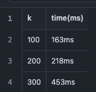

# Problem 2: Hand-on Experience with Open Source Search Engine

Pian Wan, pianwan@gatech.edu

## Introduction

In this assignment, a toy search engine with documents from `https://en.wikipedia.org/wiki` is built. This search engine will crawl random documents from wikipedia and create index for search.

## Build

To build this toy project, you will need install `maven` and `jdk21`first, then type:

```bash
mvn clean package
```

## Run

Confirm your jdk version

```bash
java --version
```

It should output something like

```text
openjdk 21.0.5 2024-10-15 LTS
OpenJDK Runtime Environment Zulu21.38+21-CA (build 21.0.5+11-LTS)
OpenJDK 64-Bit Server VM Zulu21.38+21-CA (build 21.0.5+11-LTS, mixed mode, sharing)
```

After build, you can find the executable jar file in `./target`, to crawl/create index/search, use

```bash
java -jar LuceneDemo-1.0-SNAPSHOT.jar
```

The program will be blocked and waiting for your command as input.

To craw 100 random documents from `https://en.wikipedia.org/wiki`, input

```text
craw 100
```

To create index for crawled documents, input

```text
index
```

To search some keyword, e.g. `life`, input

```text
search life
```

For convenience, the jar file have been attached as deliverable. You have to use jdk21 for testing.

## Homework Tasks

### (1) Complete the setup of your toy search engine system with initial 100 documents, show your index with 5 example keywords (index terms).

In the first task, we crawled 100 documents from wikipedia.org, then create index for these documents.
We input `craw 100` to craw 100 documents from wiki, and then input `index` to create index for the documents we crawled.

```text
java -jar target/LuceneDemo-1.0-SNAPSHOT.jar
Crawler/Indexer/Searcher for wikipedia.org
Input your action:
craw 100
>
Crawler start
Crawled: Lucie Campbell
Crawled: Richard Barrington, 4th Viscount Barrington
Crawled: John Watt Reid
Crawled: Goyencourt
Crawled: NKX6-1
Crawled: Group 47
Crawled: Joe Fison
Crawled: Logicism
Crawled: F. Harold Dubord
Crawled: C11H13ClN2
Crawled: Oenocarpus bacaba
Crawled: St Paulinus' Church, New Ollerton
Crawled: Cédric Sacras
Crawled: Caroline Pizzala
Crawled: Camp Grant (Illinois)
Crawled: Civil Air Guard
Crawled: Otto Schmidt-Hartung
Crawled: Mratín
Crawled: Zabłotnia
Crawled: Antoine Pierre de Clavel
Crawled: Gaston Breitling
Crawled: Huron-Wendat Nation
Crawled: Conservatoire du Bégonia
Crawled: William Nagle (figure skater)
Crawled: Parahibolites
Crawled: Marchetti
Crawled: Ricardo L. Castro
Crawled: Kynan Brown
Crawled: 1990 New York Attorney General election
Crawled: Noel McCalla
Crawled: 1955 Michigan State Spartans football team
Crawled: Jerzy Czarnecki
Crawled: Jeremy Gallon
Crawled: Randolph's Leap (band)
Crawled: Macrodomain
Crawled: Elijah Wood
Crawled: Aliwal, Jalandhar
Crawled: Mount Pleasant, North Carolina
Crawled: The Last Word (Knight short story)
Crawled: Danny van Trijp
Crawled: D. J. Turner (wide receiver)
Crawled: 2001–02 AHL season
Crawled: Adelbert Edward Hanna
Crawled: Izatha dasydisca
Crawled: Federal Reserve Bank of New York Buffalo Branch
Crawled: 1918 Colorado gubernatorial election
Crawled: Ntabankulu Local Municipality elections
Crawled: Alfred Stephenson
Crawled: National Register of Historic Places listings in Turner County, Georgia
Crawled: Le Nove porcelain
Crawled: 1993 OTB International Open – Men's doubles
Crawled: Salselas (Macedo de Cavaleiros)
Crawled: Zetas Vieja Escuela
Crawled: 2018 FIVB Women's Volleyball Nations League squads
Crawled: Árpád stripes
Crawled: 1976 Virginia Slims of Detroit
Crawled: 1997 European Athletics U23 Championships – Women's shot put
Crawled: Leschenaultia bicolor
Crawled: Scottish Tartans Authority
Crawled: Buenos Aires Grand Prix (motor racing)
Crawled: Lazar Pavić
Crawled: Basketball at the 2011 European Youth Summer Olympic Festival
Crawled: Hawks' Club
Crawled: Epsilon Canis Minoris
Crawled: 1241 in poetry
Crawled: Stand and Deliver
Crawled: It's Classy, Not Classic
Crawled: Wilhelm Bernatzik
Crawled: 2017 in Romanian kickboxing
Crawled: 2009 Major League Soccer season
Crawled: Alexander Rabagliati
Crawled: Swimming at the 2008 Summer Paralympics – Women's 200 metre individual medley SM7
Crawled: Stan Bentvelsen
Crawled: Teragra angulifascia
Crawled: Sinchon
Crawled: Cinema Rex bombing
Crawled: Kathryn Janeway
Crawled: Vaux-Andigny
Crawled: Cercospora apii
Crawled: Rick James (baseball)
Crawled: The Block Island Sound
Crawled: Steve Adler (politician)
Crawled: Alphonse Puthren
Crawled: Imène Cherif-Sahraoui
Crawled: Jay Vine
Crawled: Northern Power Station (South Australia)
Crawled: List of minor planets: 314001–315000
Crawled: Darren Eadie
Crawled: Schotten Totten
Crawled: Jacki Randall
Crawled: FM-2030
Crawled: OneFamily Fund
Crawled: Florida Airport (Cuba)
Crawled: Gnowangerup Star
Crawled: Thanks I Needed That
Crawled: Henry L. Newhouse
Crawled: Ptychosalpinx globulus
Crawled: Angelópolis Lifestyle Center
Crawled: Odrava
Crawled: Cinereous tit
Total time: 56131ms
Input your action:
index
>
Creating index
Jan 22, 2025 4:21:21 PM org.apache.lucene.internal.vectorization.VectorizationProvider lookup
WARNING: Java vector incubator module is not readable. For optimal vector performance, pass '--add-modules jdk.incubator.vector' to enable Vector API.
Indexing complete!
Total time: 180ms
```

To test our search engine, we use keywords `team`, `election`, `summer`, `year`, `December` to search.

Result for `team`:

```text
Searching for team
Found 0 hits hits.
Total time: 6ms
```

Result for `election`:

```text
Searching for election
Found 1 hits hits.
Total time: 15ms
>
Printing search result
Title: Ntabankulu Local Municipality elections
Url: https://en.wikipedia.org/wiki/Ntabankulu_Local_Municipality_elections
Introduction: The Ntabankulu Local Municipality council consists of thirty-eight members elected by mixed-member proportional representation. Nineteen councillors are elected by first-past-the-post voting in nineteen wards, while the remaining nineteen are chosen from party lists so that the total number of party representatives is proportional to the number of votes received. In the election of 1 November 2021 the African National Congress (ANC) won a majority of thirty-one seats.
```

Result for `summer`:

```text
Searching for summer
Found 1 hits hits.
Total time: 7ms
>
Printing search result
Title: Imène Cherif-Sahraoui
Url: https://en.wikipedia.org/wiki/Im%C3%A8ne_Cherif-Sahraoui
Introduction: Imène Ouneyssa Cherif Sahraoui (Arabic: إيمان ونعيسة شريف صحراوي, born September 14, 1995) is an Algerian sailor. She placed 37th in the Laser Radial event at the 2016 Summer Olympics.[1][2]
```

Result for `year`:

```text
Searching for year
Found 2 hits hits.
Total time: 6ms
>
Printing search result
Title: 1993 OTB International Open – Men's doubles
Url: https://en.wikipedia.org/wiki/1993_OTB_International_Open_%E2%80%93_Men%27s_doubles
Introduction: Jacco Eltingh and Paul Haarhuis were the defending champions, but lost in the first round this year.
Title: Epsilon Canis Minoris
Url: https://en.wikipedia.org/wiki/Epsilon_Canis_Minoris
Introduction: Epsilon Canis Minoris (ε Canis Minoris) is a suspected binary star[10] system in the equatorial constellation of Canis Minor. It is a fifth magnitude star, which means it is bright enough to be faintly visible to the naked eye.[2] Based upon an annual parallax shift of just 3.13 mas as seen from Earth,[1] this star is located roughly 770 light years from the Sun, give or take a 40 light year margin of error.[5]
```

Result for `December`:

```text
Searching for December
Found 2 hits hits.
Total time: 6ms
>
Printing search result
Title: Danny van Trijp
Url: https://en.wikipedia.org/wiki/Danny_van_Trijp
Introduction: Danny van Trijp (born 24 December 1996) is a Dutch darts player who plays in Professional Darts Corporation (PDC) events. He is a two-time title winner on the PDC Challenge Tour.
Title: F. Harold Dubord
Url: https://en.wikipedia.org/wiki/F._Harold_Dubord
Introduction: Frederik Harold Dubord (December 14, 1891 – October 14, 1964) was an American attorney and politician from Maine. Dubord served five terms as the mayor of Waterville, Maine, from 1928 to 1932. In 1936, Dubord was the Maine Democratic Party's nominee for governor, which he lost to Republican Lewis O. Barrows.
```

### (2) Add 1 web document and show that this document will be indexed and searched using your toy search engine. Also show the update of your index.

We crawled 1 more document and recreate the index.

```text
Input your action:
craw 1
>
Crawler start
Crawled: Anna Kyoyama
Total time: 352ms
Input your action:
index
>
Creating index
Indexing complete!
Total time: 20ms
```

Then we test if the new document can be searched.

```text
Input your action:
search Anna
>
Searching for Anna
Found 1 hits hits.
Total time: 6ms
>
Printing search result
Title: Anna Kyoyama
Url: https://en.wikipedia.org/wiki/Anna_Kyoyama
Introduction: Anna Kyōyama (恐山 アンナ, Kyōyama Anna) is a fictional character created by manga author Hiroyuki Takei. She appears in Shaman King as a primary character, while an alternate character with the same name and similar appearance appears in Butsu Zone, and Itako no Anna, a one-shot chapter which focuses on Anna (and where she first made her appearance). Takei notes in an interview, that she is like his own personal mascot or good luck charm because Anna appears (albeit usually in cameos) in so many of his works.[1]
```

### (3) add 100 documents and show that all 100 documents are indexed and searched by your toy search engine. Also show the update of your index.

We crawled 100 more document and recreate the index.

```text
Input your action:
craw 100
>
Crawler start
Crawled: Indian Physical Society
Crawled: Russ Klein
Crawled: Mark Canning (footballer)
Crawled: Tūtira Mai Ngā Iwi
Crawled: Babington Hospital
Crawled: George Richardson (footballer, born 1899)
Crawled: David L. Wilkinson
Crawled: Lawrence Hamner Brinker
Crawled: White-barred piculet
Crawled: Van Loan
Crawled: Sembé District
Crawled: Maa Pallelo Gopaludu
Crawled: 2022–23 RB Leipzig (women) season
Crawled: Tan France
Crawled: Sopot, Dolj
Crawled: Matt Saunders (rugby union, born 1982)
Crawled: Madagascar at the 2022 Winter Olympics
Crawled: 2010–11 RPI Engineers women's ice hockey season
Crawled: Goran Mrđen
Crawled: Lampropholis robertsi
Crawled: The Incredibly Strange Creatures Who Stopped Living and Became Mixed-Up Zombies
Crawled: Edo Queens F.C.
Crawled: Western House of Refuge
Crawled: Chandrapur railway station
Crawled: Fusinus marisinicus
Crawled: Sergei Ledovskikh
Crawled: List of places in California (J)
Crawled: Brooklyn Banks
Crawled: Futurism (music)
Crawled: Lárus Johnsen
Crawled: James Bond III
Crawled: Henry Walker (cricketer)
Crawled: Adasi
Crawled: L.A. Mass Choir
Crawled: East Cavan Gaels GAA
Crawled: Copelatus zadiensis
Crawled: Phu Dong Ninh Binh FC
Crawled: Parufamet
Crawled: Kathryn Imrie
Crawled: Powiadacze
Crawled: Gregg Mayles
Crawled: Murray Tyrrell
Crawled: Grit (newspaper)
Crawled: Alastair Robin McGlashan
Crawled: List of Arizona Wildcats head softball coaches
Crawled: Ratomir Dugonjić
Crawled: History of the Assyrians
Crawled: Ramsay Sheds, New Brunswick
Crawled: Death of Jezebel
Crawled: Joseph Bermingham (priest)
Crawled: Mount Halimun Salak National Park
Crawled: C. W. Smith (racing driver)
Crawled: 2004 United States House of Representatives elections in New York
Crawled: Tayster and Rojac Records
Crawled: Scey-Maisières
Crawled: Subang National Golf Club
Crawled: Stone Fort Township, Saline County, Illinois
Crawled: Sally Cinnamon
Crawled: Mikuriyama Kofun group
Crawled: Griffon Nivernais
Crawled: No One's Normal When You're Near
Crawled: Magae Station
Crawled: Abu Bakr Effendi
Crawled: Fairmile D motor torpedo boat
Crawled: 1723 in Canada
Crawled: Tikkama Saluva
Crawled: Sealed (album)
Crawled: Vrbnik Statute
Crawled: Seán Clancy
Crawled: Given Up
Crawled: Marc Drillech
Crawled: Stadnyk
Crawled: Rhodolaena humblotii
Crawled: The Minnesota Pioneer to its Patrons
Crawled: 479
Crawled: Pitcairnia longissimiflora
Crawled: Hotteok
Crawled: Pachypanchax playfairii
Crawled: Hexpressions
Crawled: List of NATO bombings
Crawled: Museum für Kommunikation Hamburg
Crawled: Ozarba acclivis
Crawled: Moscow University Ice Shelf
Crawled: New Zealand flatworm
Crawled: Gorakhpur–Anand Vihar Terminal Humsafar Express (via Basti)
Crawled: Ablekuma North
Crawled: Yeniköy, Alanya
Crawled: Hylaeogena
Crawled: Falling into You
Crawled: Joseph Lookstein
Crawled: Sveti Florijan
Crawled: Ouvrage Sapey
Crawled: Heleen Mees
Crawled: Q (emulator)
Crawled: René Ricolfi-Doria
Crawled: Rhabdomiris striatellus
Crawled: Chris Layton
Crawled: Scawfell Island leaf-tailed gecko
Crawled: Cambridge movement (philosophy)
Crawled: Hoàng Thái Bình
Total time: 62064ms
Input your action:
index
>
Creating index
Indexing complete!
Total time: 26ms
```

Then we tested the new 100 documents can be searched:

First keyword `magae` to search for Magae Station:

```text
Input your action:
search magae
>
Searching for magae
Found 1 hits hits.
Total time: 3ms
>
Printing search result
Title: Magae Station
Url: https://en.wikipedia.org/wiki/Magae_Station
Introduction: Magae Station (馬替駅, Magae-eki) is a railway station on the Hokuriku Railroad Ishikawa Line in the city of Kanazawa, Ishikawa Prefecture Japan, operated by the private railway operator Hokuriku Railroad (Hokutetsu).[1]
```

Second keyword `December` to show that we can search both the first 100 documents and the 100 documents we added later:

```text
Searching for December
Found 4 hits hits.
Total time: 4ms
>
Printing search result
Title: David L. Wilkinson
Url: https://en.wikipedia.org/wiki/David_L._Wilkinson
Introduction: David Lawrence Wilkinson (December 6, 1936 – December 10, 2022) was an American politician and lawyer who served as the 16th Attorney General of Utah from 1981 to 1989 as a Republican.[1]
Title: Danny van Trijp
Url: https://en.wikipedia.org/wiki/Danny_van_Trijp
Introduction: Danny van Trijp (born 24 December 1996) is a Dutch darts player who plays in Professional Darts Corporation (PDC) events. He is a two-time title winner on the PDC Challenge Tour.
Title: F. Harold Dubord
Url: https://en.wikipedia.org/wiki/F._Harold_Dubord
Introduction: Frederik Harold Dubord (December 14, 1891 – October 14, 1964) was an American attorney and politician from Maine. Dubord served five terms as the mayor of Waterville, Maine, from 1928 to 1932. In 1936, Dubord was the Maine Democratic Party's nominee for governor, which he lost to Republican Lewis O. Barrows.
Title: Joseph Lookstein
Url: https://en.wikipedia.org/wiki/Joseph_Lookstein
Introduction: Joseph Hyman Lookstein (Hebrew: יוסף לוקשטיין; December 25, 1902 – July 13, 1979) was a Russian-born American rabbi who served as spiritual leader of Congregation Kehilath Jeshurun on the Upper East Side of Manhattan and was a leader in Orthodox Judaism, including his service as president of the Rabbinical Council of America and of the cross-denominational Synagogue Council of America and New York Board of Rabbis. He was President of Bar-Ilan University from 1957 to 1967.[1]
```

### (4) Perform measurement on adding K documents to your toy search engine. For example, measuring performance of adding K documents and display the time cost on y-axis with x-axis varing K from 100, 200, 300

Now we restart our program. To measure the performance, we have an experiment with the inputs:

```text
java -Xint -jar --add-modules jdk.incubator.vector target/LuceneDemo-1.0-SNAPSHOT.jar

craw 0
index
index
search December
search December
craw 100
index
search December
craw 200
index
search December
craw 300
index
search December
```

Everytime we use `craw 100`, there will be 100 additional documents crawled from wiki. When applying `index`, index will be create from all the documents in cache.
As a result, k=100, k=200, k=300 will be measuted.

The result is:

k=100, total=100

```text
Creating index
Indexing complete!
Total time: 163ms

Searching for December
Found 1 hits hits.
Total time: 7ms
```

k=200, total=300

```text
Creating index
Indexing complete!
Total time: 218ms
Input your action:
>
Searching for December
Found 3 hits hits.
Total time: 10ms
```

k=300, total=600

```text
Creating index
Indexing complete!
Total time: 453ms

Searching for December
Found 9 hits hits.
Total time: 16ms
```

### (5) Discuss your observations and elaborate your discussion, including critique on the toy search engine (pros and cons) and your suggestions for improvement.

In our experiments, we build a crawler with jsoup. The crawler will automatically fetch documents from en.wikipedia.org/wiki/Special:Random.
By give command `craw <amount>`, out crawler will start crawling. All of the documents are stored in memory, and the indexing and searching are also operated in memory.
The indexing and search are built with Lucene.

In out experiments, I use the program to crawl 100 documents from wiki, and the build the index for searching. It successfully provided search results for the five keywords "team", "election", "summer", "year" and "December".

Then, we crawled another document and added it to our search system. In the test, the new document are successfully indexed for searching by testing with keyword "Anna".

Then we crawled 100 other documents and added it to index. Keyword "magae" is used to test the added documents is valid, and keyword "December" is used to test adding new documents will not affect the existing documents in the system.

The performance measurement has been down in (4). For k=100, k=200, k=300, we can learn that the indexing time increases and the search time increase. That's because the total documents in the search engine grows. 

For improvement, our search engine is build with in-memory storage, there is no persistence data in the storage. It ensures fast indexing and searching, but it lacks the ability to function with large amount of documents. Persist data option may be provided.

## Deliverable

### (a) Source code and executable with readme.

Attached.

### (b) Discuss the design of your crawler: Pros and cons.

See (5) before

### (c) Screen Shots of your toy search engine command lines or GUI


### (d) Index and search performance in excel or tabular format

[Index Performance](./performance_index.csv)



[Search Performance](./performance_search.csv)


### (e) Example index entries.

See (1) (2) (3) before

### (f) Discuss your experience and lessons learned.

In this project, I gained great learning experience in building a simple search engine with components like crawling, indexing, and searching. Specifically, the experience to use Apache Lucene and designing a basic system for document retrieval.
For Crawling, jsoup is used to fetch random Wikipedia pages worked well but highlighted challenges like handling large-scale or complex websites.
For indexing and searching, Lucene makes indexing straightforward, but rebuilding the index for every update showed the need for incremental indexing in real-world systems.

In this project, I learnt that 1) incremental indexing would improve efficiency when adding new documents. 2)A better crawler and user-friendly interface would enhance usability and practicality. 3) the performance drops with the increase of document amounts.
Overall, I learnt basics of search engine design, performance trade-offs, and areas for improvement, which will be useful for future development.