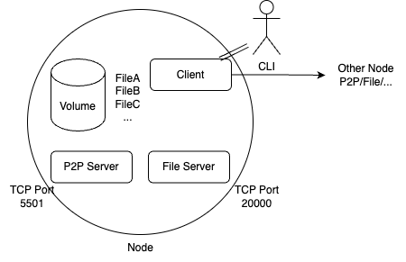
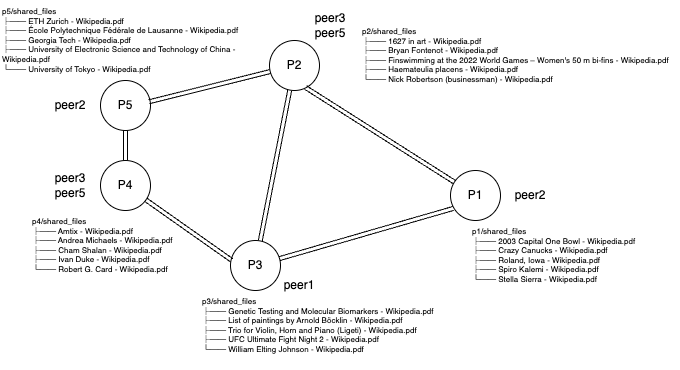
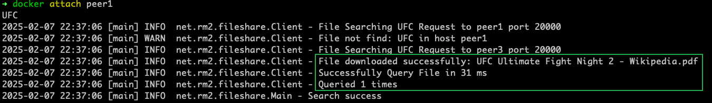
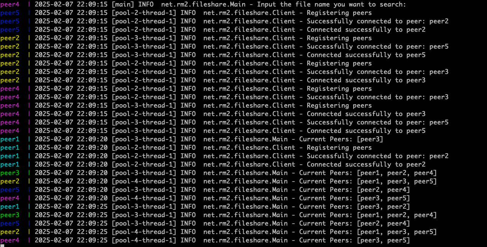
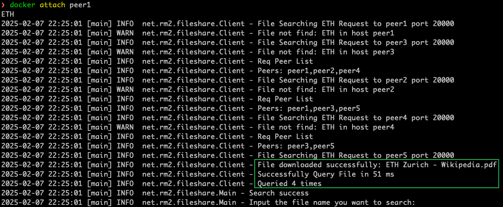

# Problem 1. Hand-on Experience with Unstructured Peer to Peer System

Pian Wan, pianwan@gatech.edu

## Introduction
In this homework, I select `Option (1)` Once you complete the setup of your toy P2P search system with minimum of 5 peers. You are asked to install 5 song files or text files at each peer. Hint: search keywords should be used to name your files. Then perform two types of measurement for your toy P2P search system.

**I build a P2P file sharing system from scratch, which is "You may also create a P2P application of your own" in the homework description.**

In the experiment, the peer shares pdf files download from Wiki (https://en.wikipedia.org/). Some of the pdfs are randomly selected, some are manually selected.

## Build/Run

### Requirements
- Docker Engine
- Docker Compose & Docker Swarm
- maven
- jdk21

### Build
Before running the container, you have to build the p2p file sharing system first.
```bash
mvn clean package
```
Then, you can find a `P2P-1.0-SNAPSHOT.jar` file in `./target`.

With this file, you can build the docker image with:

```bash
docker build .
```

With the image, you can start the p2p file sharing environment with
```bash
docker compose up
```

For simplify, you can also use:
```bash
docker compose up --build
```

- [DockerFile](./Dockerfile)
- [docker-compose.yml](./docker-compose.yml)

## Unstructured P2P 

### Single Node


For a single node, there are mainly 3 components.

First, a P2P Server [PeerServer.java](./src/main/java/net/rm2/fileshare/PeerServer.java).
This is used for maintain the graph structure of self-organizing overlay network. Every P2P Server stores the address and ports for the nearby P2P Server.
For a new node to join a P2P Network, it needs to create a TCP connection to at least one of the P2P Server in the network and then send a message "REGISTER <peerAddress>".
Every one can query the nearby nodes of any node in the network. To query nearby nodes, send "LIST" to the P2P Server.

Second, a File Server [FileServer.java](./src/main/java/net/rm2/fileshare/FileServer.java). This server is used for handling file download request.
If current node own the file needed, it will return the requested file otherwise return NOT_FOUND.
There is a volume along with this File Server. In the homework, we store 5 files for each peer.

Third, a Client [Client.java](./src/main/java/net/rm2/fileshare/Client.java). This is a user interface.
Users can use the client to interact with the node (e.g. searching, connecting to other nodes, etc).
To search a file, call `searchFile(String name)` method. You can input any sentence you want to search in the command line interface since the client is built with the jar.


### Overlay


This is an example overlay for the testing, you can choose any overlay you want. This overlay can be easily modified, to modify peer1, go `./p1/connection`

In order to make sure the connectivity of the network, every node in the overlay needs to know at least one other node (i.e. hostname and port).

In the image, P1 knows peer2. P2 knows peer3 and peer5. P3 knows peer1. P4 knows peer3 and peer5. P5 knows peer2.

- Peer 1 knows Peer 2
- Peer 2 knows Peer 3, Peer 5
- Peer 3 knows Peer 1
- Peer 4 knows Peer 3, Peer 5
- Peer 5 knows Peer 2

Each peer maintains connections in its configuration file (./pX/connection for peer X).

### Query
Two methods of querying are implemented.

- Flooding: We query all neighbours. This is efficient in a small p2p network.

- RandomWalk: We query random neighbour. This reduces workload in a large p2p network.

To use RandomWalk, the environment variable RANDOM should be true.

## Experiment Details

### (1) Baseline measurement: you are asked to measure the performance of your keyword query requests in terms of the latency (average time needed per query) and throughput (#queries served per time unit).
The response time is printed to compute latency and throughput.
For example, to search the keyword `UFC`, we will have the following:


- Latency: 31ms
- Throughput: 1 / 31ms = 32.26 queries/sec

So, the latency is `31ms`, the throughput is `32.26/s` which is 1/latency.


### (2) You are required to use one of the following three types of workload setups: (2.2) varying the number of queries from 10, 20, 40, but with a fixed number of files shared among the 5 peers, say 5 or 10. Compare the latency and throughput performance of these three top P2P systems.

In (2), I do (2.2) as my choice.
The sentences used for query are at [./query.txt](query.txt). Our p2p system has 5 peers. The number and structure are fixed during the experiments.

For 10, use the 10 beginning sentences. The results are:
```text
2025-02-08 00:16:54 [main] INFO  net.rm2.fileshare.Client - Failed Query File in 40 ms
2025-02-08 00:16:54 [main] INFO  net.rm2.fileshare.Client - Failed Query File in 12 ms
2025-02-08 00:16:54 [main] INFO  net.rm2.fileshare.Client - Successfully Query File in 15 ms
2025-02-08 00:16:54 [main] INFO  net.rm2.fileshare.Client - Failed Query File in 13 ms
2025-02-08 00:16:54 [main] INFO  net.rm2.fileshare.Client - Successfully Query File in 8 ms
2025-02-08 00:16:54 [main] INFO  net.rm2.fileshare.Client - Failed Query File in 12 ms
2025-02-08 00:16:54 [main] INFO  net.rm2.fileshare.Client - Successfully Query File in 8 ms
2025-02-08 00:16:54 [main] INFO  net.rm2.fileshare.Client - Successfully Query File in 5 ms
2025-02-08 00:16:54 [main] INFO  net.rm2.fileshare.Client - Failed Query File in 6 ms
2025-02-08 00:16:54 [main] INFO  net.rm2.fileshare.Client - Successfully Query File in 3 ms
```

Total 122ms, Throughput 8.19/s

latency: 12.2ms

throughput: 82/s


For 20, use the 20 beginning sentences. The results are:
```text
2025-02-08 00:19:01 [main] INFO  net.rm2.fileshare.Client - Failed Query File in 32 ms
2025-02-08 00:19:01 [main] INFO  net.rm2.fileshare.Client - Failed Query File in 13 ms
2025-02-08 00:19:01 [main] INFO  net.rm2.fileshare.Client - Successfully Query File in 21 ms
2025-02-08 00:19:01 [main] INFO  net.rm2.fileshare.Client - Failed Query File in 7 ms
2025-02-08 00:19:01 [main] INFO  net.rm2.fileshare.Client - Successfully Query File in 7 ms
2025-02-08 00:19:01 [main] INFO  net.rm2.fileshare.Client - Failed Query File in 6 ms
2025-02-08 00:19:01 [main] INFO  net.rm2.fileshare.Client - Successfully Query File in 6 ms
2025-02-08 00:19:01 [main] INFO  net.rm2.fileshare.Client - Successfully Query File in 5 ms
2025-02-08 00:19:01 [main] INFO  net.rm2.fileshare.Client - Failed Query File in 6 ms
2025-02-08 00:19:01 [main] INFO  net.rm2.fileshare.Client - Successfully Query File in 3 ms
2025-02-08 00:19:01 [main] INFO  net.rm2.fileshare.Client - Successfully Query File in 2 ms
2025-02-08 00:19:01 [main] INFO  net.rm2.fileshare.Client - Failed Query File in 4 ms
2025-02-08 00:19:01 [main] INFO  net.rm2.fileshare.Client - Failed Query File in 4 ms
2025-02-08 00:19:01 [main] INFO  net.rm2.fileshare.Client - Failed Query File in 4 ms
2025-02-08 00:19:01 [main] INFO  net.rm2.fileshare.Client - Successfully Query File in 10 ms
2025-02-08 00:19:01 [main] INFO  net.rm2.fileshare.Client - Successfully Query File in 8 ms
2025-02-08 00:19:01 [main] INFO  net.rm2.fileshare.Client - Successfully Query File in 7 ms
2025-02-08 00:19:01 [main] INFO  net.rm2.fileshare.Client - Failed Query File in 5 ms
2025-02-08 00:19:01 [main] INFO  net.rm2.fileshare.Client - Successfully Query File in 4 ms
2025-02-08 00:19:01 [main] INFO  net.rm2.fileshare.Client - Failed Query File in 4 ms
2025-02-08 00:19:01 [main] INFO  net.rm2.fileshare.Client - Successfully Query File in 14 ms
2025-02-08 00:19:01 [main] INFO  net.rm2.fileshare.Client - Successfully Query File in 12 ms
```

Total 185ms, Throughput 5.40/s

latency: 9.2ms

throughput: 108/s

For 40, use the 40 beginning sentences. The results are:

```text
2025-02-08 00:22:42 [main] INFO  net.rm2.fileshare.Client - Failed Query File in 28 ms
2025-02-08 00:22:42 [main] INFO  net.rm2.fileshare.Client - Failed Query File in 6 ms
2025-02-08 00:22:42 [main] INFO  net.rm2.fileshare.Client - Successfully Query File in 38 ms
2025-02-08 00:22:42 [main] INFO  net.rm2.fileshare.Client - Failed Query File in 5 ms
2025-02-08 00:22:42 [main] INFO  net.rm2.fileshare.Client - Successfully Query File in 5 ms
2025-02-08 00:22:42 [main] INFO  net.rm2.fileshare.Client - Failed Query File in 5 ms
2025-02-08 00:22:42 [main] INFO  net.rm2.fileshare.Client - Successfully Query File in 4 ms
2025-02-08 00:22:42 [main] INFO  net.rm2.fileshare.Client - Successfully Query File in 5 ms
2025-02-08 00:22:42 [main] INFO  net.rm2.fileshare.Client - Failed Query File in 4 ms
2025-02-08 00:22:42 [main] INFO  net.rm2.fileshare.Client - Successfully Query File in 3 ms
2025-02-08 00:22:42 [main] INFO  net.rm2.fileshare.Client - Successfully Query File in 2 ms
2025-02-08 00:22:42 [main] INFO  net.rm2.fileshare.Client - Failed Query File in 4 ms
2025-02-08 00:22:42 [main] INFO  net.rm2.fileshare.Client - Failed Query File in 5 ms
2025-02-08 00:22:42 [main] INFO  net.rm2.fileshare.Client - Failed Query File in 4 ms
2025-02-08 00:22:42 [main] INFO  net.rm2.fileshare.Client - Successfully Query File in 10 ms
2025-02-08 00:22:42 [main] INFO  net.rm2.fileshare.Client - Successfully Query File in 5 ms
2025-02-08 00:22:42 [main] INFO  net.rm2.fileshare.Client - Successfully Query File in 5 ms
2025-02-08 00:22:42 [main] INFO  net.rm2.fileshare.Client - Failed Query File in 5 ms
2025-02-08 00:22:42 [main] INFO  net.rm2.fileshare.Client - Successfully Query File in 4 ms
2025-02-08 00:22:42 [main] INFO  net.rm2.fileshare.Client - Failed Query File in 4 ms
2025-02-08 00:22:42 [main] INFO  net.rm2.fileshare.Client - Successfully Query File in 12 ms
2025-02-08 00:22:42 [main] INFO  net.rm2.fileshare.Client - Successfully Query File in 11 ms
2025-02-08 00:22:42 [main] INFO  net.rm2.fileshare.Client - Failed Query File in 5 ms
2025-02-08 00:22:42 [main] INFO  net.rm2.fileshare.Client - Successfully Query File in 2 ms
2025-02-08 00:22:42 [main] INFO  net.rm2.fileshare.Client - Failed Query File in 4 ms
2025-02-08 00:22:42 [main] INFO  net.rm2.fileshare.Client - Failed Query File in 5 ms
2025-02-08 00:22:42 [main] INFO  net.rm2.fileshare.Client - Failed Query File in 4 ms
2025-02-08 00:22:42 [main] INFO  net.rm2.fileshare.Client - Successfully Query File in 5 ms
2025-02-08 00:22:42 [main] INFO  net.rm2.fileshare.Client - Successfully Query File in 5 ms
2025-02-08 00:22:42 [main] INFO  net.rm2.fileshare.Client - Failed Query File in 6 ms
2025-02-08 00:22:42 [main] INFO  net.rm2.fileshare.Client - Successfully Query File in 5 ms
2025-02-08 00:22:42 [main] INFO  net.rm2.fileshare.Client - Failed Query File in 5 ms
2025-02-08 00:22:42 [main] INFO  net.rm2.fileshare.Client - Failed Query File in 5 ms
2025-02-08 00:22:42 [main] INFO  net.rm2.fileshare.Client - Successfully Query File in 2 ms
2025-02-08 00:22:42 [main] INFO  net.rm2.fileshare.Client - Failed Query File in 4 ms
2025-02-08 00:22:42 [main] INFO  net.rm2.fileshare.Client - Failed Query File in 5 ms
2025-02-08 00:22:42 [main] INFO  net.rm2.fileshare.Client - Failed Query File in 3 ms
2025-02-08 00:22:42 [main] INFO  net.rm2.fileshare.Client - Successfully Query File in 5 ms
2025-02-08 00:22:42 [main] INFO  net.rm2.fileshare.Client - Successfully Query File in 5 ms
2025-02-08 00:22:42 [main] INFO  net.rm2.fileshare.Client - Failed Query File in 5 ms
2025-02-08 00:22:42 [main] INFO  net.rm2.fileshare.Client - Successfully Query File in 5 ms
2025-02-08 00:22:42 [main] INFO  net.rm2.fileshare.Client - Failed Query File in 5 ms
```

Total time 264ms, Throughput 3.79/s

latency: 6.6ms

throughput: 113.7/s

To summary, the latency and throughput for single query are almost the same while varying the number of queries from 10, 20, 40.
The bottleneck of latency is the workload, i.e. the size of the file.

## Deliverable

### URL of the P2P source code downloaded.
This repository. https://github.com/pianwan/CS6675

### Screen shots of your P2P Command lines or GUIs, showing the membership, the query and the routing functionality (operations) of this toy P2P system.

From the screenshots, peer1's current neighbors are peer2 and peer3. peer2's current neighbours are peer1, peer3 and peer5.
peer3's current neighbors are peer1, peer2 and peer4. peer4's current neighbors are peer3 and peer5.
peer5's current neighbors are peer2 and peer4.

The routing operations are defined in the `connection` file. See peer1's connection file at [./p1/connection](./p1/connection).


To attach into the container, use `docker attach peer1`. Then you can see the Command line interface for users.
To search a file which contains 'ETH' in the filename, input `ETH`.

### Measurement comparison in terms of throughput and latency of two routing protocols of this toy P2P system: the default routing protocol and your proposed routing protocol.

For flooding, see (2) in the experiment details.
For RandomWalk,

```text
2025-02-08 00:50:50 [main] INFO  net.rm2.fileshare.Client - Failed Query File in 38 ms
2025-02-08 00:50:50 [main] INFO  net.rm2.fileshare.Client - Failed Query File in 12 ms
2025-02-08 00:50:50 [main] INFO  net.rm2.fileshare.Client - Successfully Query File in 18 ms
2025-02-08 00:50:50 [main] INFO  net.rm2.fileshare.Client - Failed Query File in 13 ms
2025-02-08 00:50:50 [main] INFO  net.rm2.fileshare.Client - Successfully Query File in 6 ms
2025-02-08 00:50:50 [main] INFO  net.rm2.fileshare.Client - Failed Query File in 18 ms
2025-02-08 00:50:50 [main] INFO  net.rm2.fileshare.Client - Successfully Query File in 13 ms
2025-02-08 00:50:50 [main] INFO  net.rm2.fileshare.Client - Failed Query File in 7 ms
2025-02-08 00:50:50 [main] INFO  net.rm2.fileshare.Client - Failed Query File in 5 ms
2025-02-08 00:50:50 [main] INFO  net.rm2.fileshare.Client - Successfully Query File in 6 ms
```
Total time 136ms, Throughput 7.35294/s

latency: 13.6ms

throughput: 73.53/s

```text
2025-02-08 00:51:03 [main] INFO  net.rm2.fileshare.Client - Failed Query File in 30 ms
2025-02-08 00:51:03 [main] INFO  net.rm2.fileshare.Client - Failed Query File in 10 ms
2025-02-08 00:51:03 [main] INFO  net.rm2.fileshare.Client - Successfully Query File in 13 ms
2025-02-08 00:51:03 [main] INFO  net.rm2.fileshare.Client - Failed Query File in 8 ms
2025-02-08 00:51:03 [main] INFO  net.rm2.fileshare.Client - Successfully Query File in 4 ms
2025-02-08 00:51:03 [main] INFO  net.rm2.fileshare.Client - Failed Query File in 7 ms
2025-02-08 00:51:03 [main] INFO  net.rm2.fileshare.Client - Failed Query File in 6 ms
2025-02-08 00:51:03 [main] INFO  net.rm2.fileshare.Client - Failed Query File in 5 ms
2025-02-08 00:51:03 [main] INFO  net.rm2.fileshare.Client - Failed Query File in 6 ms
2025-02-08 00:51:03 [main] INFO  net.rm2.fileshare.Client - Failed Query File in 5 ms
2025-02-08 00:51:03 [main] INFO  net.rm2.fileshare.Client - Successfully Query File in 5 ms
2025-02-08 00:51:03 [main] INFO  net.rm2.fileshare.Client - Failed Query File in 5 ms
2025-02-08 00:51:03 [main] INFO  net.rm2.fileshare.Client - Failed Query File in 5 ms
2025-02-08 00:51:03 [main] INFO  net.rm2.fileshare.Client - Failed Query File in 5 ms
2025-02-08 00:51:03 [main] INFO  net.rm2.fileshare.Client - Successfully Query File in 15 ms
2025-02-08 00:51:03 [main] INFO  net.rm2.fileshare.Client - Successfully Query File in 12 ms
2025-02-08 00:51:03 [main] INFO  net.rm2.fileshare.Client - Successfully Query File in 8 ms
2025-02-08 00:51:03 [main] INFO  net.rm2.fileshare.Client - Failed Query File in 6 ms
2025-02-08 00:51:03 [main] INFO  net.rm2.fileshare.Client - Failed Query File in 4 ms
2025-02-08 00:51:03 [main] INFO  net.rm2.fileshare.Client - Failed Query File in 5 ms
2025-02-08 00:51:03 [main] INFO  net.rm2.fileshare.Client - Failed Query File in 4 ms
2025-02-08 00:51:03 [main] INFO  net.rm2.fileshare.Client - Successfully Query File in 13 ms
```
Total time 181ms, Throughput 5.52486/s

latency: 9.1ms

throughput: 110.5/s
```text
2025-02-08 00:51:13 [main] INFO  net.rm2.fileshare.Client - Failed Query File in 26 ms
2025-02-08 00:51:13 [main] INFO  net.rm2.fileshare.Client - Failed Query File in 11 ms
2025-02-08 00:51:13 [main] INFO  net.rm2.fileshare.Client - Successfully Query File in 14 ms
2025-02-08 00:51:13 [main] INFO  net.rm2.fileshare.Client - Failed Query File in 8 ms
2025-02-08 00:51:13 [main] INFO  net.rm2.fileshare.Client - Successfully Query File in 9 ms
2025-02-08 00:51:13 [main] INFO  net.rm2.fileshare.Client - Failed Query File in 6 ms
2025-02-08 00:51:13 [main] INFO  net.rm2.fileshare.Client - Successfully Query File in 5 ms
2025-02-08 00:51:13 [main] INFO  net.rm2.fileshare.Client - Successfully Query File in 5 ms
2025-02-08 00:51:13 [main] INFO  net.rm2.fileshare.Client - Failed Query File in 4 ms
2025-02-08 00:51:13 [main] INFO  net.rm2.fileshare.Client - Successfully Query File in 6 ms
2025-02-08 00:51:13 [main] INFO  net.rm2.fileshare.Client - Successfully Query File in 4 ms
2025-02-08 00:51:13 [main] INFO  net.rm2.fileshare.Client - Failed Query File in 5 ms
2025-02-08 00:51:13 [main] INFO  net.rm2.fileshare.Client - Failed Query File in 6 ms
2025-02-08 00:51:13 [main] INFO  net.rm2.fileshare.Client - Failed Query File in 4 ms
2025-02-08 00:51:13 [main] INFO  net.rm2.fileshare.Client - Successfully Query File in 9 ms
2025-02-08 00:51:13 [main] INFO  net.rm2.fileshare.Client - Successfully Query File in 18 ms
2025-02-08 00:51:13 [main] INFO  net.rm2.fileshare.Client - Successfully Query File in 8 ms
2025-02-08 00:51:13 [main] INFO  net.rm2.fileshare.Client - Failed Query File in 4 ms
2025-02-08 00:51:13 [main] INFO  net.rm2.fileshare.Client - Failed Query File in 4 ms
2025-02-08 00:51:13 [main] INFO  net.rm2.fileshare.Client - Failed Query File in 3 ms
2025-02-08 00:51:13 [main] INFO  net.rm2.fileshare.Client - Successfully Query File in 10 ms
2025-02-08 00:51:13 [main] INFO  net.rm2.fileshare.Client - Successfully Query File in 9 ms
2025-02-08 00:51:13 [main] INFO  net.rm2.fileshare.Client - Failed Query File in 4 ms
2025-02-08 00:51:13 [main] INFO  net.rm2.fileshare.Client - Successfully Query File in 4 ms
2025-02-08 00:51:13 [main] INFO  net.rm2.fileshare.Client - Failed Query File in 3 ms
2025-02-08 00:51:13 [main] INFO  net.rm2.fileshare.Client - Failed Query File in 3 ms
2025-02-08 00:51:13 [main] INFO  net.rm2.fileshare.Client - Failed Query File in 4 ms
2025-02-08 00:51:13 [main] INFO  net.rm2.fileshare.Client - Successfully Query File in 4 ms
2025-02-08 00:51:13 [main] INFO  net.rm2.fileshare.Client - Successfully Query File in 4 ms
2025-02-08 00:51:13 [main] INFO  net.rm2.fileshare.Client - Failed Query File in 4 ms
2025-02-08 00:51:13 [main] INFO  net.rm2.fileshare.Client - Failed Query File in 3 ms
2025-02-08 00:51:13 [main] INFO  net.rm2.fileshare.Client - Failed Query File in 4 ms
2025-02-08 00:51:13 [main] INFO  net.rm2.fileshare.Client - Failed Query File in 5 ms
2025-02-08 00:51:13 [main] INFO  net.rm2.fileshare.Client - Successfully Query File in 4 ms
2025-02-08 00:51:13 [main] INFO  net.rm2.fileshare.Client - Failed Query File in 3 ms
2025-02-08 00:51:13 [main] INFO  net.rm2.fileshare.Client - Failed Query File in 3 ms
2025-02-08 00:51:13 [main] INFO  net.rm2.fileshare.Client - Failed Query File in 4 ms
2025-02-08 00:51:13 [main] INFO  net.rm2.fileshare.Client - Failed Query File in 3 ms
2025-02-08 00:51:13 [main] INFO  net.rm2.fileshare.Client - Successfully Query File in 5 ms
2025-02-08 00:51:13 [main] INFO  net.rm2.fileshare.Client - Failed Query File in 4 ms
2025-02-08 00:51:13 [main] INFO  net.rm2.fileshare.Client - Successfully Query File in 3 ms
2025-02-08 00:51:13 [main] INFO  net.rm2.fileshare.Client - Failed Query File in 4 ms
```
Total time 253ms, Throughput 3.95/s

latency: 6.3ms

throughput: 158.10/s


Comparison

|                         | Flooding | RandomWalk |
|:------------------------|---------:|:----------:|
| latency (10 queries)    |   12.2ms |   13.6ms   |
| throughput (10 queries) |     82/s |  73.53/s   |
| latency (20 queries)    |    9.2ms |   9.1ms    |
| throughput (20 queries) |    108/s |  110.5/s   |
| latency (40 queries)    |    6.6ms |   6.3ms    |
| throughput (40 queries) |  113.7/s |  158.10/s  |

### Discuss latency and throughput of your toy P2P system under the two alternative routing protocols in terms of pros and cons.
**Flooding**

Broadcasts queries to all neighbors.

Pros:
- Fast in small networks.
- High success rate.

Cons:
- High network traffic.
- Not scalable (exponential message growth).

**Random Walk**

Queries a random neighbor instead of broadcasting.

Pros:
- Reduces network load.
- Scales well for large networks.

Cons:
- Higher query failure rate.
- Slower response time.
### Discuss scalability, reliability and anonymity of your P2P system.
Scalability
- Flooding doesn’t scale well (exponential query explosion).
- Random Walk scales better (but has lower success rates).
- Possible Improvement: Implement a Hybrid Routing system (Flooding + Random Walk).

Reliability
- If a peer goes offline, its connections are lost.
- In Flooding, as long as any peer has the file, the request succeeds.
- In Random Walk, if the query is misrouted, it fails.
- Possible Improvement: Implement a replication mechanism where multiple peers store copies of files.

Anonymity
- Flooding exposes queries to all peers, reducing anonymity.
- Random Walk improves anonymity, as only a small subset of peers sees the query.
- Possible Improvement: Implement Tor-like onion routing in the P2P system.
### [Option] Discuss any additional functionality you wish to introduce if any.
- Caching: Peers cache popular files to reduce redundant requests.
- Data Encryption: Encrypt file transfers for improved security.
- File Prioritization: Allow peers to prioritize certain file types for better performance.