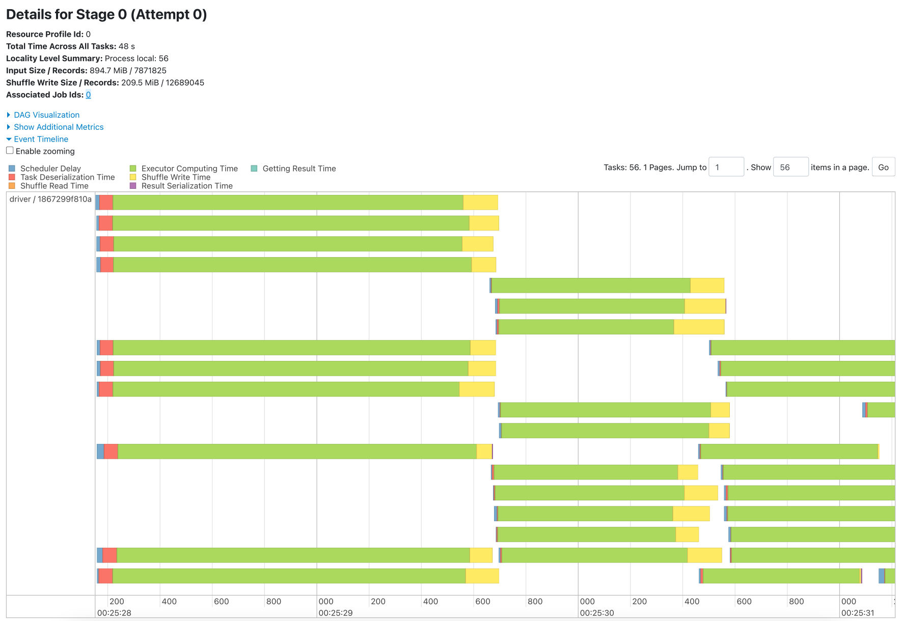
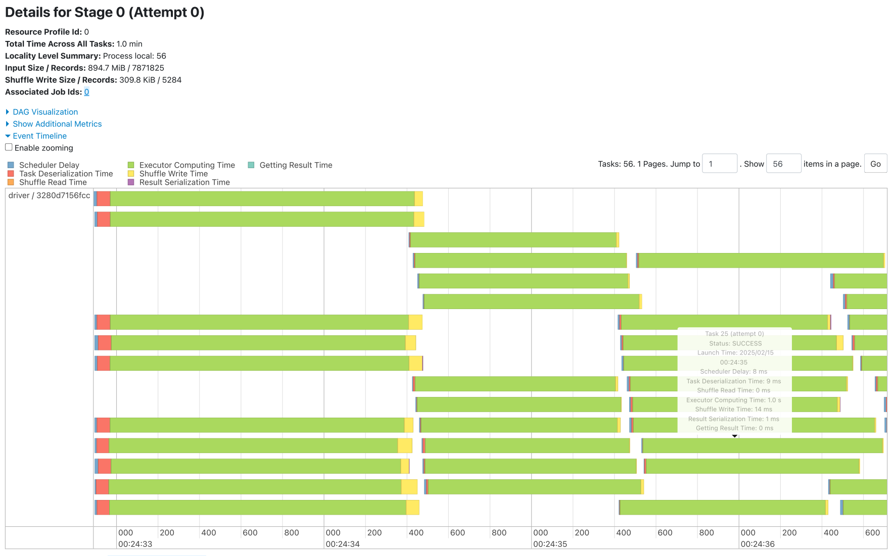
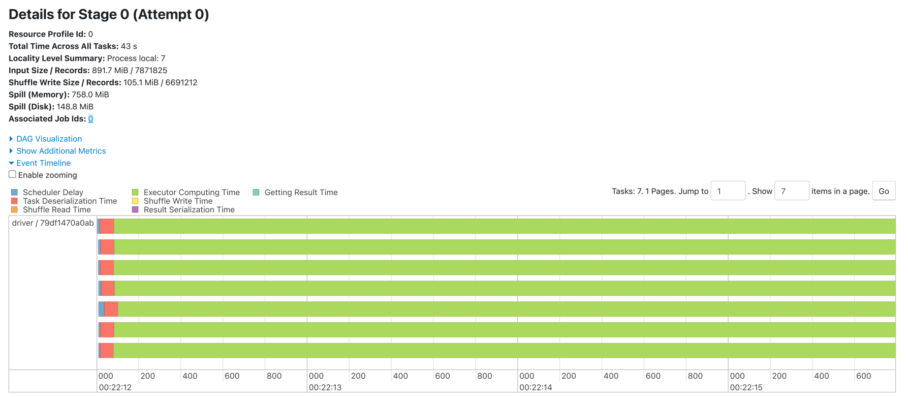
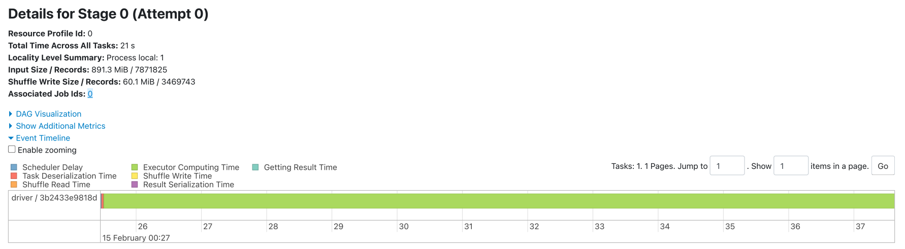
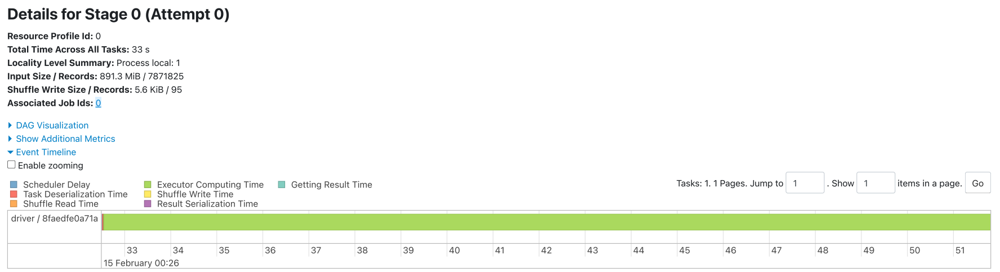

# Problem 3. Learning Configuring SPARK Jobs

Pian Wan, pianwan@gatech.edu

## Introduction

I select `Option 2: Chunk Size optimization` for this homework.

## Build/Run

### Requirements

- Docker Engine

## Three first steps

### 1. Download Spark on your laptop and run one example program of your choice on two example datasets provided in the Spark package.

I use apache/spark-docker image for the experiments below. The repository is at https://github.com/apache/spark-docker

I use docker to run the examples with LinearRegressionExample:

On `sample_multiclass_classification_data.txt` dataset

```bash
docker run --rm \
  spark:3.5.4-java17 /opt/spark/bin/spark-submit \
  --class org.apache.spark.examples.ml.LinearRegressionExample \
  --master "local[*]" \
  --jars /opt/spark/examples/jars/scopt_2.12-3.7.1.jar \
  /opt/spark/examples/jars/spark-examples.jar \
  /opt/spark/data/mllib/sample_multiclass_classification_data.txt \
```

sample_lda_libsvm_data.txt
On `sample_linear_regression_data.txt` dataset.

```bash
docker run --rm \
  spark:3.5.4-java17 /opt/spark/bin/spark-submit \
  --class org.apache.spark.examples.ml.LinearRegressionExample \
  --master "local[*]" \
  --jars /opt/spark/examples/jars/scopt_2.12-3.7.1.jar \
  /opt/spark/examples/jars/spark-examples.jar \
  /opt/spark/data/mllib/sample_linear_regression_data.txt
```

### 2. Report the runtime performance for your chosen example program using two different sizes of datasets.

To get the size of the dataset. First, use

```bash
docker run --rm \
  spark:3.5.4-java17 wc -c \
  /opt/spark/data/mllib/sample_multiclass_classification_data.txt \
  /opt/spark/data/mllib/sample_linear_regression_data.txt
```

```text
  6953 /opt/spark/data/mllib/sample_multiclass_classification_data.txt
119069 /opt/spark/data/mllib/sample_linear_regression_data.txt
126022 total
```

Since the size of the example data is small, and the data is loaded use `RDD` which uses a fixed configuration. Here, I
will not use the monitoring tools by spark.
For simplicity, use `time` to log the whole running time.

```bash
time docker run --rm \
  spark:3.5.4-java17 /opt/spark/bin/spark-submit \
  --class org.apache.spark.examples.ml.LinearRegressionExample \
  --master "local[*]" \
  --jars /opt/spark/examples/jars/scopt_2.12-3.7.1.jar \
  /opt/spark/examples/jars/spark-examples.jar \
  /opt/spark/data/mllib/sample_multiclass_classification_data.txt
```

```text
docker run --rm spark:3.5.4-java17 /opt/spark/bin/spark-submit --class         0.02s user 0.03s system 1% cpu 4.597 total
```

```bash
time docker run --rm \
  spark:3.5.4-java17 /opt/spark/bin/spark-submit \
  --class org.apache.spark.examples.ml.LinearRegressionExample \
  --master "local[*]" \
  --jars /opt/spark/examples/jars/scopt_2.12-3.7.1.jar \
  /opt/spark/examples/jars/spark-examples.jar \
  /opt/spark/data/mllib/sample_linear_regression_data.txt
```

```text
docker run --rm spark:3.5.4-java17 /opt/spark/bin/spark-submit --class         0.02s user 0.03s system 1% cpu 4.720 total
```

### 3. You may use excel file to generate your runtime statistics plot or organize the performance measurement data in a tabular format.

| Dataset File                                | Size (Bytes) | Time (Seconds) |
|---------------------------------------------|--------------|----------------|
| `sample_multiclass_classification_data.txt` | 6,953        | 4.597          |
| `sample_linear_regression_data.txt`         | 119,069      | 4.720          |

## Deliverable

### (a) URL to the Spark code and the datasets used

Code: This repository https://github.com/pianwan/CS6675/SparkDemo

Dataset: https://www.kaggle.com/datasets/mikeortman/wikipedia-sentences

You have to download this dataset and extract it to ./data/wikisent2.txt

The size of the file wikisent2.txt is 891M.

### (b) screen shots of your execution process.

In the execution process, the chunk sizes are tested in 16MB, 128MB (default), 1024MB.
I run two MapReduce Programs JavaWordCount (TaskA) and JavaCharacterCount (TaskB) in the execution process.

For 16MB,

```bash
docker run --rm -p 4040:4040 \
  -v ./data/wikisent2.txt:/opt/spark/work-dir/data/wikisent2.txt \
  -v ./target/SparkDemo-1.0-SNAPSHOT.jar:/opt/spark/work-dir/demo.jar \
  spark:3.5.4-java17 /opt/spark/bin/spark-submit \
  --conf spark.sql.files.maxPartitionBytes=16MB \
  --conf spark.sql.files.openCostInBytes=16MB \
  --conf spark.default.parallelism=4 \
  --class net.rm2.sparkdemo.JavaWordCount \
  --master "local[*]" \
  /opt/spark/work-dir/demo.jar \
  /opt/spark/work-dir/data/wikisent2.txt

docker run --rm -p 4040:4040 \
  -v ./data/wikisent2.txt:/opt/spark/work-dir/data/wikisent2.txt \
  -v ./target/SparkDemo-1.0-SNAPSHOT.jar:/opt/spark/work-dir/demo.jar \
  spark:3.5.4-java17 /opt/spark/bin/spark-submit \
  --conf spark.sql.files.maxPartitionBytes=16MB \
  --conf spark.sql.files.openCostInBytes=16MB \
  --conf spark.default.parallelism=4 \
  --class net.rm2.sparkdemo.JavaCharacterCount \
  --master "local[*]" \
  /opt/spark/work-dir/demo.jar \
  /opt/spark/work-dir/data/wikisent2.txt
```

Results:

[PDF Report for JavaWordCount](./docs/word16.pdf)

[PDF Report for JavaCharacterCount](./docs/char16.pdf)




For 128MB

```bash
docker run --rm -p 4040:4040 \
  -v ./data/wikisent2.txt:/opt/spark/work-dir/data/wikisent2.txt \
  -v ./target/SparkDemo-1.0-SNAPSHOT.jar:/opt/spark/work-dir/demo.jar \
  spark:3.5.4-java17 /opt/spark/bin/spark-submit \
  --conf spark.sql.files.maxPartitionBytes=128MB \
  --conf spark.sql.files.openCostInBytes=128MB \
  --conf spark.default.parallelism=4 \
  --class net.rm2.sparkdemo.JavaWordCount \
  --master "local[*]" \
  /opt/spark/work-dir/demo.jar \
  /opt/spark/work-dir/data/wikisent2.txt

docker run --rm -p 4040:4040 \
  -v ./data/wikisent2.txt:/opt/spark/work-dir/data/wikisent2.txt \
  -v ./target/SparkDemo-1.0-SNAPSHOT.jar:/opt/spark/work-dir/demo.jar \
  spark:3.5.4-java17 /opt/spark/bin/spark-submit \
  --conf spark.sql.files.maxPartitionBytes=128MB \
  --conf spark.sql.files.openCostInBytes=128MB \
  --conf spark.default.parallelism=4 \
  --class net.rm2.sparkdemo.JavaCharacterCount \
  --master "local[*]" \
  /opt/spark/work-dir/demo.jar \
  /opt/spark/work-dir/data/wikisent2.txt
```

Results:

[PDF Report for JavaWordCount](./docs/word128.pdf)

[PDF Report for JavaCharacterCount](./docs/char128.pdf)




For 1024MB

```bash
docker run --rm -p 4040:4040 \
  -v ./data/wikisent2.txt:/opt/spark/work-dir/data/wikisent2.txt \
  -v ./target/SparkDemo-1.0-SNAPSHOT.jar:/opt/spark/work-dir/demo.jar \
  spark:3.5.4-java17 /opt/spark/bin/spark-submit \
  --conf spark.sql.files.maxPartitionBytes=1024MB \
  --conf spark.sql.files.openCostInBytes=1024MB \
  --conf spark.default.parallelism=4 \
  --class net.rm2.sparkdemo.JavaWordCount \
  --master "local[*]" \
  /opt/spark/work-dir/demo.jar \
  /opt/spark/work-dir/data/wikisent2.txt

docker run --rm -p 4040:4040 \
  -v ./data/wikisent2.txt:/opt/spark/work-dir/data/wikisent2.txt \
  -v ./target/SparkDemo-1.0-SNAPSHOT.jar:/opt/spark/work-dir/demo.jar \
  spark:3.5.4-java17 /opt/spark/bin/spark-submit \
  --conf spark.sql.files.maxPartitionBytes=1024MB \
  --conf spark.sql.files.openCostInBytes=1024MB \
  --conf spark.default.parallelism=4 \
  --class net.rm2.sparkdemo.JavaCharacterCount \
  --master "local[*]" \
  /opt/spark/work-dir/demo.jar \
  /opt/spark/work-dir/data/wikisent2.txt
```

Results:

[PDF Report for JavaWordCount](./docs/word1024.pdf)

[PDF Report for JavaCharacterCount](./docs/char1024.pdf)




### (c) Runtime statistics in excel plots or tabular format.

| Chunk Size      | Chunk Amount = Task Amount | Runtime (A) | Runtime (B) | Med Task Duration (A) | Med Task Duration (B) | Shuffle Write Size (A) | Shuffle Write Size (B) |
|-----------------|----------------------------|-------------|-------------|-----------------------|-----------------------|------------------------|------------------------|
| 16MB            | 56                         | 48s         | 1min        | 0.8s                  | 1s                    | 209.8MB                | 309.8KB                |
| 128MB (default) | 7                          | 43s         | 40s         | 6s                    | 6s                    | 105.1MB                | 39.1KB                 |
| 1024MB          | 1                          | 21s         | 33s         | 21s                   | 33s                   | 60.1MB                 | 5.6KB                  |

### (d) Your analysis.

The experiment determine the effect of chunk sizes on two MapReduce programs, JavaWordCount and JavaCharacterCount, in
the Spark environment. The examined chunk sizes of 16MB, 128MB (default), and 1024MB illustrate the effects of data
partitioning on runtime, task scheduling, and memory consumption.

When using 16MB chunks, Spark divided the workload into 56 tasks. The workload was more parallelized than it was at
128MB chunks. The increase in the number of issued tasks, however, led to more scheduling, serialization, and shuffle
overhead, which caused longer execution times (48s for WordCount, 1 min for CharacterCount). In spite of exceptionally
low median task duration figures (0.8s and 1s), the increased coordination overhead made completion infeasible. Memory
pressure and data movement costs increased significantly due to the increase in shuffle write size for JavaWordCount (
209.5 MiB).

With 128MB chunks (default setting), the number of tasks was significantly reduced to 7. The better balance that 128MB
chunks had between the number of issued tasks and the execution overhead boosted runtime (43s for WordCount, 40s for
CharacterCount). Memory spills, however, were noticed in JavaWordCount (758MB to memory, 148MB to disk), suggesting that
performance was negatively impacted due to tasks exceeding available memory.

At 1024MB chunk size, only one task was executed. A single task was performed which completely removed the scheduling
overhead. This led to the lowest execution times (21 seconds for WordCount and 33 seconds for CharacterCount),
demonstrating that not having to align tasks, mitigate shuffling, and overwrite unneeded information enhances the
processing speed. This does come at the expense of parallelism which means that there is a possibilty of facing
challenges with scaling on multi-node clusters. The memory usage for JavaWordCount was capped at 326MB which indicates
that the simplistic structure was able to efficiently utilize memory resources.

In conclusion, smaller chunk sizes have excessive scheduling overhead while on the positive end, larger chunk sizes have
improved runtime at the expense of parallelism due to minimized coordination and shuffle costs.
Small Chunk Size has higher parallelism, but increases task scheduling overhead. Small Chunk Size are ideal for
query/grep tasks that require fine-grained parallelism as they have increased overhead for task scheduling. On the other
hand, they do need more coordination which leads to higher overhead.
Default Size is the go to chunk sizes for batch processing and data transformations. optimized for balancing task
scheduling and parallelism.
Large Chunk Size avoids shuffle overhead and has fewer partitions. However, they can lead to high memory load on
executors and low CPU usage which is not ideal. These chunk sizes tend to work best when the job workload is compute
heavy.